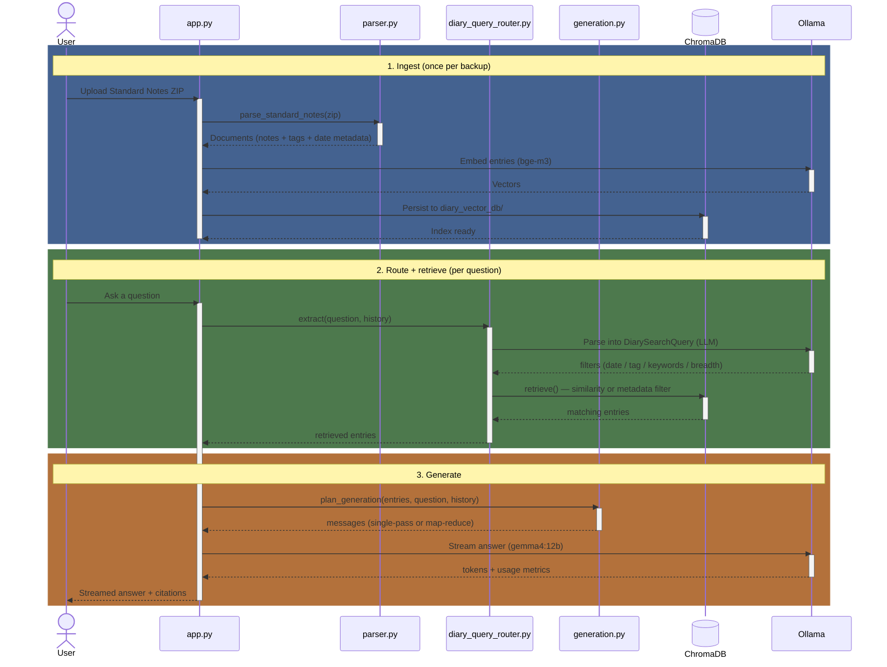

# 📔 SNChat

[](https://codecov.io/gh/matejfric/snchat)

A fully **private, offline** chatbot for your personal diary exported from
[Standard Notes](https://standardnotes.com/). Ask natural-language questions about your
journal — by topic, tag, or time period — and get answers grounded in your own entries.
Nothing ever leaves your machine.

Built with Streamlit · LangChain · ChromaDB · [Ollama](https://ollama.com/).

## Features

- 🔒 **Fully private & offline** — a local LLM (Ollama) and a local vector store
  (ChromaDB). No cloud, no API keys, no data leaving your computer.
- 🧠 **Conversational memory** — follow-up questions resolve against the chat history
  ("…in 2025?" → "and in 2026?") without losing the thread.
- 🏷️ **Metadata-aware retrieval** — filters by tag and date, not just semantic
  similarity. Multilingual tag matching lets you ask in English about non-English tags.
- 📅 **Temporal alignment** — chronological summaries and progressions ("how did my
  running develop?"), date ranges ("what did I do last week?", "how was my winter?" —
  including ranges across a year boundary), and "most recent N" queries ("summarize
  my last 10 runs").
- 🔎 **Breadth that fits the question** — narrow scopes return *every* matching entry;
  broad ones are summarized via map-reduce — instead of a fixed top-K cut-off.
- ⚡ **Live & observable** — answers stream token-by-token with a tokens/sec readout, and
  a sidebar gauge tracks context-window usage.

## Setup

Requires Python 3.12+, [uv](https://docs.astral.sh/uv/), and a running
[Ollama](https://ollama.com/).

```bash
# 1. Install dependencies
uv sync

# 2. Pull the local models (LLM + embeddings)
ollama pull gemma4:12b
ollama pull bge-m3

# 3. Run the app
uv run streamlit run app.py
```

## Usage

1. Export your notes from Standard Notes as a `.zip` backup.
2. In the sidebar, upload the ZIP and click **Process & Index Diary** (one-time; the
   index persists locally in `diary_vector_db/`).
3. Ask away.

## Your data

Each note's **title must start with an ISO date** (`yyyy-mm-dd`, optionally followed by a
title) — all date filtering derives from this, and notes without a parseable date prefix
are skipped. Tags come straight from the backup; multilingual tag synonyms are
configurable in `constants.py` (`TAG_ALIASES` - keys must match the tags from the backup).
Your diary and the built index are gitignored and never leave your machine.

## Architecture

Three stages:

1. **ingest** a backup into a local vector store,
2. **route** each question into structured filters + a retrieval strategy,
3. **generate** a grounded answer.

All LLM and embedding calls go to a local Ollama; nothing leaves the machine.



## Docs

- [CLAUDE.md](CLAUDE.md) — architecture & developer guide.
- [docs/error_modes.md](docs/error_modes.md) — known failure modes and their fixes.
